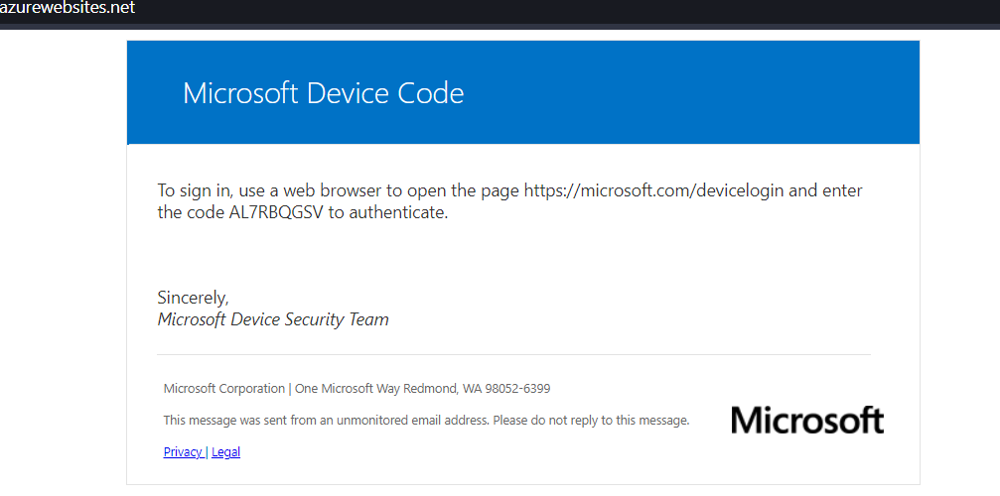
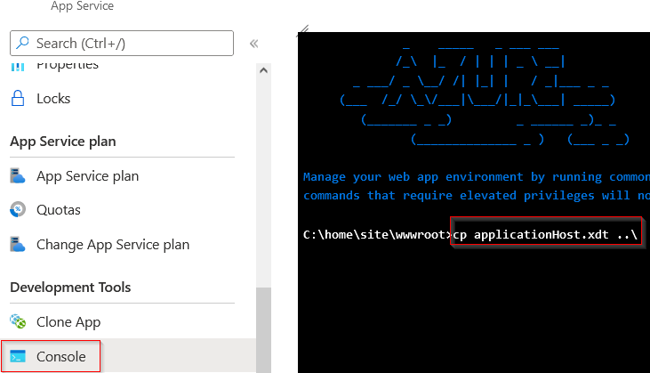

# Azure-App-Tools
 Collection of tools to use with Azure Applications.  https://azure.microsoft.com/en-us/get-started/apps/

## Prerequisites
Azure Powershell Module https://docs.microsoft.com/en-us/powershell/azure/install-az-ps?view=azps-3.8.0

## Examples:

### Dynamic Device Codes
Original PoC by @MrUn1k0d3r https://gist.github.com/Mr-Un1k0d3r/afef5a80cb72dfeaa78d14465fb0d333.

Dynamically generate device codes on an Azure website. Typically, we have to email a user and the device code has 900 seconds to expire from time of sending the email. By directing the user to a dynamic site, we extend the time we have to recieve tokens based on when the user visits the website and until they sign-in.

Uses FLUX Web3 by defult for CORS-Anywhere so, IP address for sign-in may vary. You may use other services such as Heroku Apps to host Cors-Anywhere. https://github.com/Rob--W/cors-anywhere

az webapp up --location eastus --resource-group mynewresourcegroup --name mynewsubdomain --html --sku FREE

### Static HTML Phishing Page
az webapp up --location eastus --resource-group mynewresourcegroup --name mynewsubdomain --html --sku FREE

### Azure IPFS Dropper
[Setup Instructions](./azureipfsdropper.md)

### IIS Redirector
az webapp up --location eastus --resource-group mynewresourcegroup --name mynewsubdomain --html --sku FREE

Navigate to the Azure App Console and copy the applicationHost.xdt back a directory.

### Python Flask Redirector
The redirector acts as a "dumb" redirector unless you modify the variables in application.py. See below.

Protect your servers with a secret header per my blog at https://medium.com/@rvrsh3ll/hardening-your-azure-domain-front-7423b5ab4f64

Be sure to comment the first HEADER variable and then uncomment HEADER and HEADER_KEY to use magic headers in application.py.
HEADER = None
#HEADER = "X-Aspnet-Version"
#HEADER_KEY = "1.5"

az webapp up --location eastus --resource-group mynewresourcegroup --name mynewsubdomain --SKU FREE

