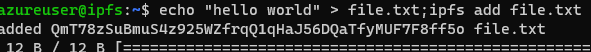

# Azure IPFS Dropper

In my class and previous [webinar](https://enterpriseattack.futuresec.io/initial-access/enterprise-attack-payload-delivery-webcast), I show my methodology for deploying phishing sites and payloads or tool dropping via Azure websites. Microsoft has improved their detections for “malicious” sites with “malware” hosted on them. In an effort to combat these detections and to continue helping clients test their networks against *.azurewebsites.net sites, I’ve created a novel way to host payloads with a NodeJS proxy serving your phishing site or payloads via InterPlanetary File System (IPFS).

👉 Note: IPFS files should be considered public and secured as such

## Create Azure VM

Use the Azure Portal to create Azure Linux virtual machine or use the following steps to create one:

1. Open a PowerShell Terminal window
2. Clone Azure-App-Tools
    
    ```powershell
    git clone https://github.com/rvrsh3ll/Azure-App-Tools
    cd Azure-App-Tools/IPFS-Dropper
    ```
    
3. Sign-in
    
    ```powershell
    az login —use-device-code
    ```
    
4. Import deployment script
    
    ```powershell
    import-module DeploymentIPFSVM.ps1
    ```
    
5. Generate an SSH key
    
    ssh-keygen -t rsa
    
6. Deploy VM
    
    ```powershell
    Invoke-DeployIPFSVM -ResourceGroup Myresourcegroup -location eastus -vmName ipfsserver -vmPublicDNSName myipfsvm -pubKey C:\Users\User\.ssh\id_rsa.pub
    ```
    
    <aside>
    👉 Note the deployed IP address
    
    </aside>
    
7. SSH to your server
    
    ```powershell
    ssh -i ~\.ssh\id_rsa azureuser@IP
    ```
    
8. Make ipfs directory
    
    ```bash
    mkdir ipfs && cd ipfs
    ```
    
9. Initialize IPFS
    
    ```bash
    ipfs init
    ```
    
10. Start daemon
    
    ```bash
    screen -dmS ipfs bash;screen -S ipfs -X stuff "ipfs daemon
    "
    ```
    
11. Add a file to IPFS
    
    ```bash
    echo "hello world" > file.txt;ipfs add file.txt
    ```
    
    
    
    <aside>
    👉 Note your IPFS file CID for the next section
    
    </aside>
    

## Deploy site

<aside>
💡 Generally following Microsoft documentation [https://learn.microsoft.com/en-us/azure/app-service/quickstart-nodejs?tabs=windows&pivots=development-environment-vscode](https://learn.microsoft.com/en-us/azure/app-service/quickstart-nodejs?tabs=windows&pivots=development-environment-vscode)

</aside>

1. In PowerShell terminal open Azure-App-Tools/IPFS-Dropper folder
2. Open code
    
    ```powershell
    code .
    ```
    
3. Modify code to your campaign
    
    
    
4. Change “startsWith” URI, IPFS CID to your site or file, and redirect URL. Save.
    
    
    
5. Install VSCode Marketplace Extensions
    
    
    
6. Sign-in to Azure and follow the instructions.
    
    
    
    <aside>
    👉 Be sure to select your correct subscription if you have multiple
    
    </aside>
    
    
    
7. Your post sign-in should look something like this
    
    
    
8. Right-click on App Services and select **Create new Web App... Advanced**.
    
    
    
9. Type a globally unique name for your web app and press **Enter**. The name must be unique across all of Azure and use only alphanumeric characters ('A-Z', 'a-z', and '0-9') and hyphens ('-').
    
    
    
10. Select **Create a new resource group**, then enter a name for the resource group, such as something-rg.
    
    
    
11. Select Node 18 LTS.
    
    
    
12. Select **Windows** for the operating system.
    
    
    
13. Select the location you want to serve your app from. For example, East US.
    
    
    
14. Select **Create new App Service plan**, then enter a name for the plan (such as something-sp), then select **F1 Free** for the pricing tier for testing.
    
    
    
    
    
15. For **Select an Application Insights resource for your app**, select **Skip for now** and wait the resources to be created in Azure.
    
    
    
16. Your app will be created
    
    
    
17. In the popup **Always deploy the workspace "yourworkspace" to <app-name>"**, select **Yes**. This way, as long as you're in the same workspace, Visual Studio Code deploys to the same App Service app each time.
18. You should see your app under your subscription.
    
    
    
19. Expand the site drop-down to expose “Application Settings”
    
    
    
20. Right-click “Application Settings” and select “Add New Setting”
    
    
    
21. Enter `SCM_DO_BUILD_DURING_DEPLOYMENT`
    
    <aside>
    👉 This setting allows the app to compile it self on deployment
    
    </aside>
    
22. Set to “true”
    
    
    
23. Right-click your site and select “Deploy to Web App”
    
    
    
24. Select the deployment folder
    
    
    
25. Confirm
    
    
    
26. Deploying (Will take a few minutes)
    
    
    
27. Success
    
    
